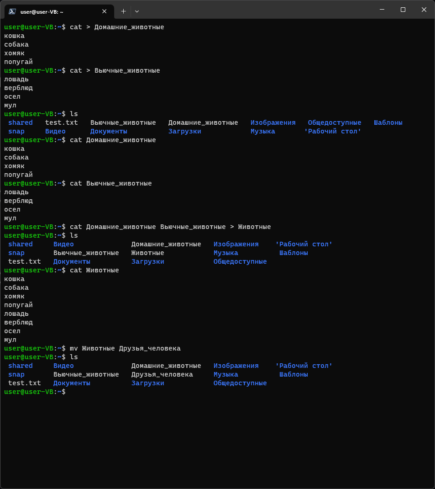
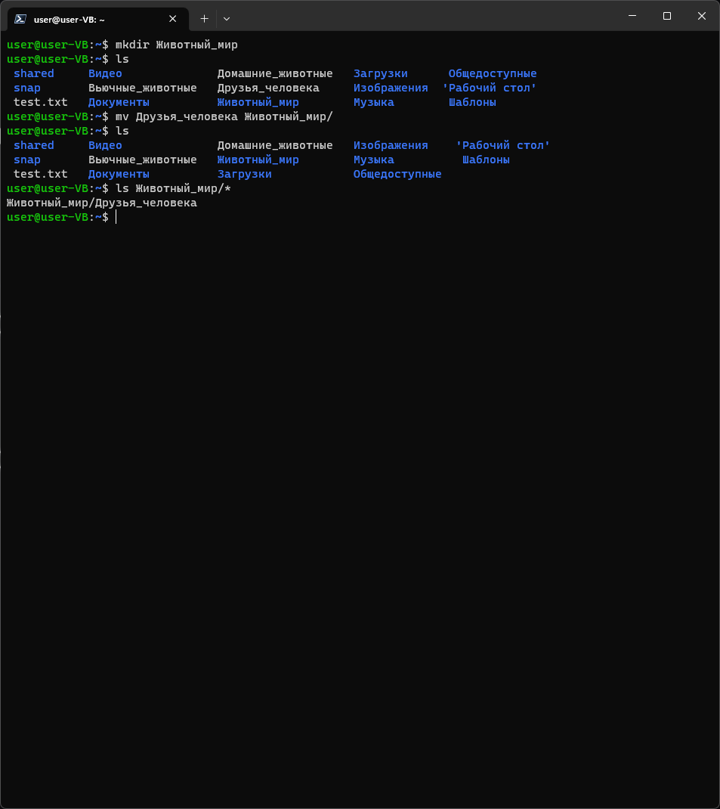
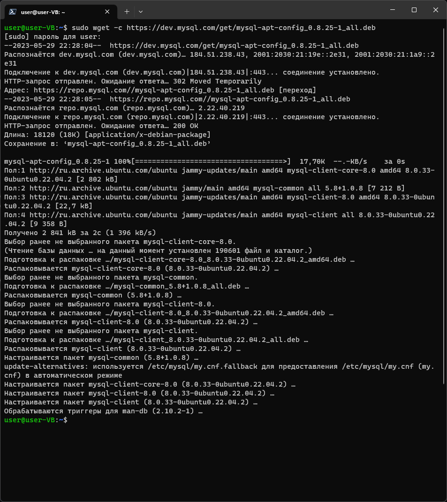
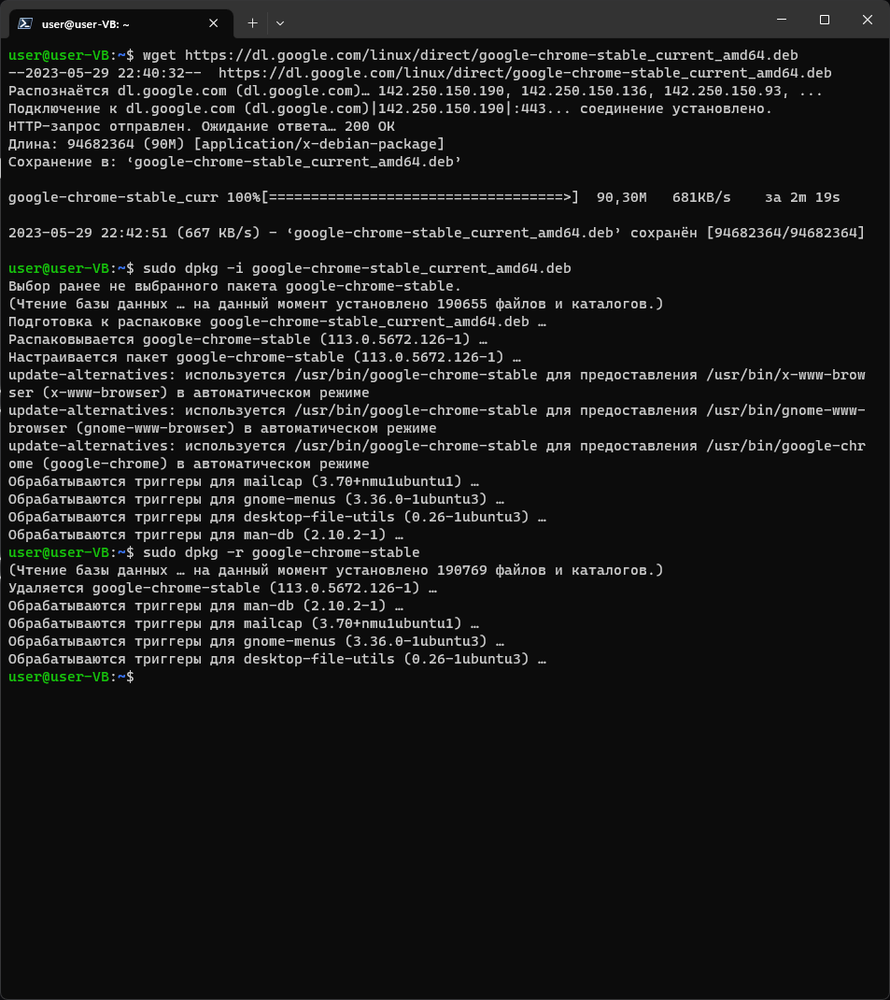
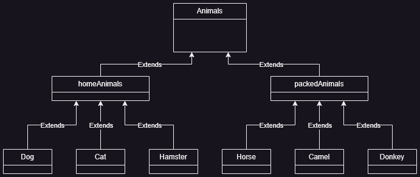
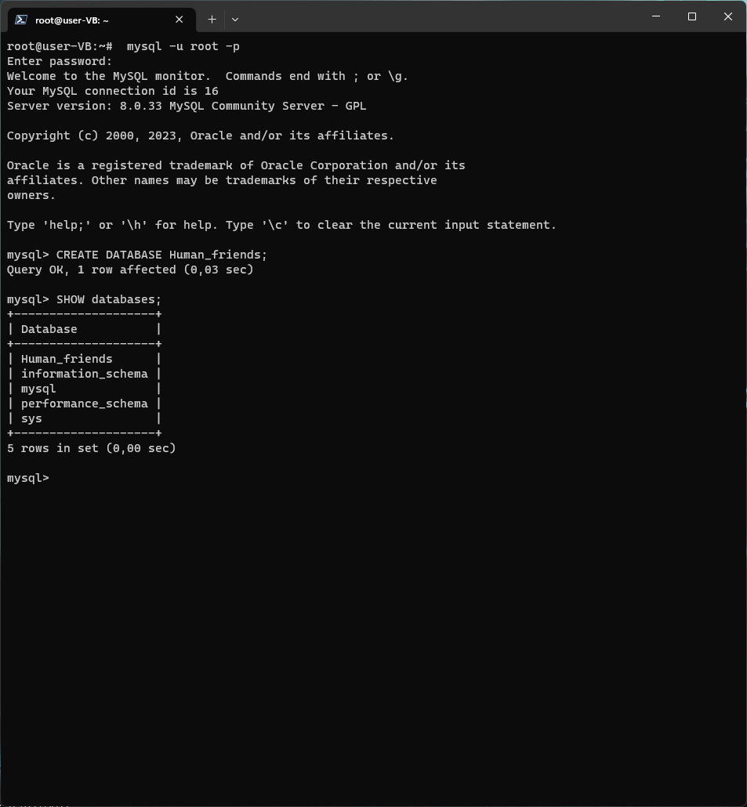

# Информация о проекте

Необходимо организовать систему учета для питомника, в котором живут
домашние и вьючные животные.

### Задание

<a href="resources/files/Итоговая%20аттестация.pdf" target="_blank">Файл задания</a>

1. Используя команду cat в терминале операционной системы Linux, создать два файла *Домашние животные* (заполнив файл собаками, кошками, хомяками) и *Вьючные животными* заполнив файл (Лошадьми, верблюдами и ослы), а затем объединить их. 
Просмотреть содержимое созданного файла. Переименовать файл, дав ему новое имя (Друзья человека).

```bash
cat > Домашние_животные
```

```
кошка
собака
хомяк
попугай
```

```bash
cat > Вьючные_животные
```

```
лошадь
верблюд
осел
мул
```

``` bash
ls
cat Домашние_животные
cat Вьючные_животные
cat Домашние_животные Вьючные_животные > Животные
ls
cat Животные
mv Животные Друзья_человека
ls
```



2. Создать директорию, переместить файл туда.

```
sudo mkdir Животный_мир
ls
sudo mv Друзья_человека Животный_мир/
ls
ls Животный_мир/*
```




3. Подключить дополнительный репозиторий MySQL. Установить любой пакет из этого репозитория.
```bash
sudo wget -c https://dev.mysql.com/get/mysql-apt-config_0.8.25-1_all.deb
sudo dpkg -i mysql-apt-config_0.8.25-1_all.deb
sudo apt install mysql-client -y
```



4. Установить и удалить deb-пакет с помощью dpkg.

```bash
wget https://dl.google.com/linux/direct/google-chrome-stable_current_amd64.deb
sudo dpkg -i google-chrome-stable_current_amd64.deb
sudo dpkg -r google-chrome-stable
```



5. Выложить историю команд в терминале ubuntu
```bash
history > TerminalHistory.txt
```

<a href="resources/files/TerminalHistory.txt" target="_blank">TerminalHistory.txt</a>

6. Нарисовать [диаграмму](./resources/diagramm/UML.drawio), в которой есть класс родительский класс, домашние животные и вьючные животные, в составы которых в случае домашних животных войдут классы: собаки, кошки, хомяки, 
а в класс вьючные животные войдут: (Лошади, верблюды и ослы).




7. В подключенном MySQL репозитории создать базу данных “Друзья человека”
```bash
mysql -u root -p
```
```SQL
CREATE DATABASE Human_friends;
SHOW databases;
```



8. Создать таблицы с иерархией из диаграммы в БД

    <a href="resources/files/Animals.sql" target="_blank">Animals.sql</a>

9.  Заполнить низкоуровневые таблицы именами(животных), командами которые они выполняют и датами рождения

    <a href="resources/files/AnimalsData.sql" target="_blank">AnimalsData.sql</a>

10. Удалив из таблицы верблюдов, т.к. верблюдов решили перевезти в другой питомник на зимовку. Объединить таблицы лошади, и ослы в одну таблицу.
```SQL
USE Human_friends;
SET SQL_SAFE_UPDATES = 0;
DELETE FROM camel;

SELECT Name, Birthday, Commands 
FROM horse
UNION 
SELECT Name, Birthday, Commands 
FROM donkey;
```

11. Создать новую таблицу “молодые животные” в которую попадут все животные старше 1 года, но младше 3 лет и в отдельном столбце с точностью до месяца подсчитать возраст животных в новой таблице

```SQL
CREATE TEMPORARY TABLE animal AS 
SELECT *, 'Лошади' as genus FROM horse
UNION SELECT *, 'Ослы' AS genus FROM donkey
UNION SELECT *, 'Собаки' AS genus FROM dog
UNION SELECT *, 'Кошки' AS genus FROM cat
UNION SELECT *, 'Хомяки' AS genus FROM hamster;

CREATE TABLE young_animal AS
SELECT Name, Birthday, Commands, genus, TIMESTAMPDIFF(MONTH, Birthday, CURDATE()) AS Age_in_month
FROM animal WHERE Birthday BETWEEN ADDDATE(curdate(), INTERVAL -3 YEAR) AND ADDDATE(CURDATE(), INTERVAL -1 YEAR);
 
SELECT * FROM young_animal;
```

12. Объединить все таблицы в одну, при этом сохраняя поля, указывающие на прошлую принадлежность к старым таблицам.

```SQL
SELECT h.Name, h.Birthday, h.Commands, pa.Genus_name, ya.Age_in_month 
FROM horse h
LEFT JOIN young_animal ya ON ya.Name = h.Name
LEFT JOIN packed_animal pa ON pa.Id = h.Genus_id
UNION 
SELECT d.Name, d.Birthday, d.Commands, pa.Genus_name, ya.Age_in_month 
FROM donkey d 
LEFT JOIN young_animal ya ON ya.Name = d.Name
LEFT JOIN packed_animal pa ON pa.Id = d.Genus_id
UNION
SELECT c.Name, c.Birthday, c.Commands, ha.Genus_name, ya.Age_in_month 
FROM cat c
LEFT JOIN young_animal ya ON ya.Name = c.Name
LEFT JOIN home_animal ha ON ha.Id = c.Genus_id
UNION
SELECT d.Name, d.Birthday, d.Commands, ha.Genus_name, ya.Age_in_month 
FROM dog d
LEFT JOIN young_animal ya ON ya.Name = d.Name
LEFT JOIN home_animal ha ON ha.Id = d.Genus_id
UNION
SELECT hm.Name, hm.Birthday, hm.Commands, ha.Genus_name, ya.Age_in_month 
FROM hamster hm
LEFT JOIN young_animal ya ON ya.Name = hm.Name
LEFT JOIN home_animal ha ON ha.Id = hm.Genus_id;
```

13. Создать класс с Инкапсуляцией методов и наследованием по диаграмме.

14. Написать программу, имитирующую работу реестра домашних животных. В программе должен быть реализован следующий функционал:
14.1 Завести новое животное
14.2 определять животное в правильный класс
14.3 увидеть список команд, которое выполняет животное
14.4 обучить животное новым командам
14.5 Реализовать навигацию по меню

15. Создайте класс Счетчик, у которого есть метод add(), увеличивающий
значение внутренней int переменной на 1 при нажатии “Завести новое
животное” Сделайте так, чтобы с объектом такого типа можно было работать в
блоке try-with-resources. Нужно бросить исключение, если работа с объектом
типа счетчик была не в ресурсном try и/или ресурс остался открыт. Значение
считать в ресурсе try, если при заведении животного заполнены все поля.